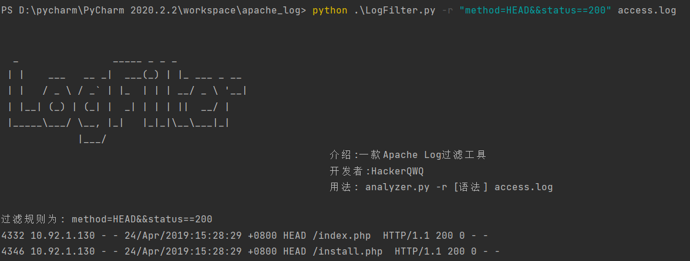
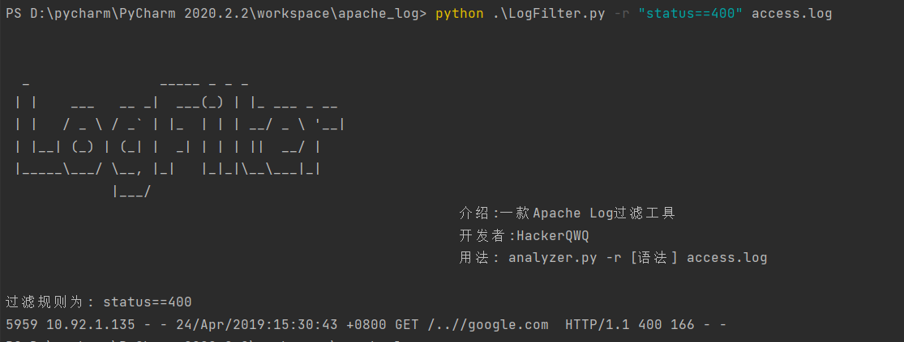
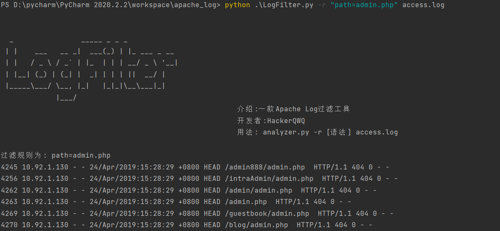
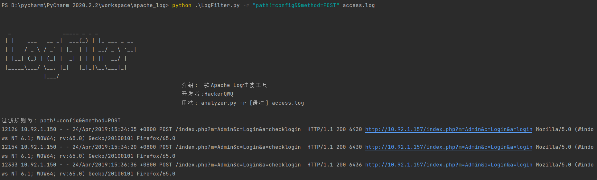

## 介绍
LogFilter: 一款简单的日志过滤工具

* 根据字段支持精确匹配，模糊匹配
* 使用sqlite存储log中的记录
* 支持多语句拼接

由于一开始没找到很合适的日志分析工具，感觉开发起来也挺简单的，就动手开发了一个简单的Apache日志过滤工具。

目前支持中间件日志：
* Apache access log

## 用法
安装
```
pip3 install -r requirements.txt
```
运行
```
python3 LogFilter.py method=GET access.log
```

支持的字段
```
ip,remote,userid,date,timezone,method,path,version,status,length,referrer,user_agent
```
目前只支持`&&`逻辑，通过拼接来实现filter日志

筛选条件支持
* `==`,精准(完全)匹配字段
* `=`,模糊匹配字段
* `!=`,排除字段中包含该字符串的结果

精确匹配
```
python LogFilter.py -r status==302 access.log
```

模糊匹配
```
python LogFilter.py -r path=admin.php access.log
```

排除某字段
```
python LogFilter.py -r path!=config&&method=POST access.log
```

## 问题
本来想用类似fofa的语句来过滤字段的，奈何数据解析部分不太行，使用正则效果不佳，如果真正想实现fofa语法，应该要用到数据结构的内容，有空再研究

Todo:
* 类fofa语法
* 正则匹配
* 加入攻击payload规则识别，高亮显示
* 增加日志格式可定制功能